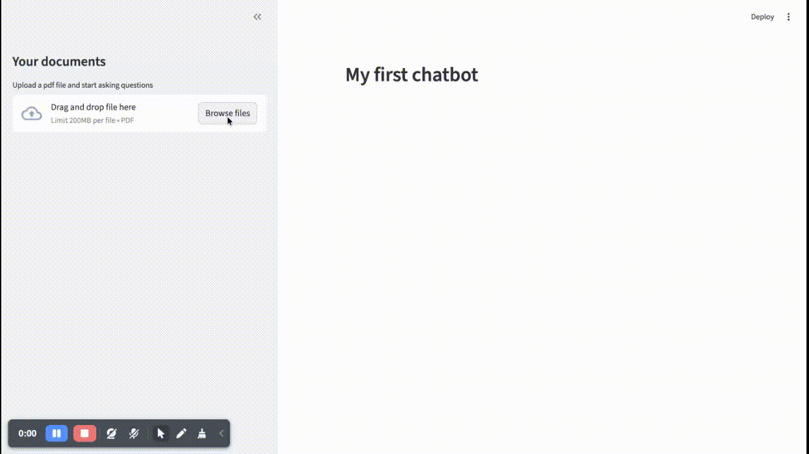

# 📄 PDF Chatbot using Streamlit + LangChain + OpenAI

An interactive **PDF Question-Answering Chatbot** built with **Streamlit**, **LangChain**, **OpenAI Embeddings**, and **FAISS Vector Database**.

Upload any PDF file and ask questions — the chatbot retrieves relevant context from the document and generates accurate answers using an LLM.

---

## 🚀 Demo Preview


---

## ✨ Features

* 📂 Upload any PDF document
* 🔍 Smart semantic search using **FAISS**
* 🧠 Context-aware answers using **LangChain Retrieval QA pipeline**
* ⚡ Fast embeddings with `text-embedding-3-small`
* 🤖 Answer generation using `gpt-4o-mini`
* 🎯 Uses **MMR retrieval strategy** for better response relevance
* 📊 Clean Streamlit UI

---

## 🏗️ Tech Stack

| Tool              | Purpose                            |
| ----------------- | ---------------------------------- |
| Streamlit         | UI interface                       |
| LangChain         | RAG pipeline                       |
| OpenAI Embeddings | Vector generation                  |
| FAISS             | Vector storage & similarity search |
| pdfplumber        | PDF text extraction                |

---

## 📁 Project Structure

```
project-folder/
│
├── app.py
├── demo.gif
├── requirements.txt
└── README.md
```

---

## ⚙️ Installation

Clone repository:

```
git clone https://github.com/GenAIRepos/chatbot.git
cd your-repo-name
```

Install dependencies:

```
pip install -r requirements.txt
```

---

## 🔑 Setup OpenAI API Key

Inside `app.py`, replace:

```
OPEN_AI_KEY = ""
```

with:

```
OPEN_AI_KEY = "your-openai-api-key"
```

Or preferably use environment variable:

```
export OPENAI_API_KEY="your-openai-api-key"
```

---

## ▶️ Run the Application

Start Streamlit server:

```
streamlit run app.py
```

Then open browser:

```
http://localhost:8501
```

---

## 🧠 How It Works (Architecture)

Pipeline:

```
PDF → Text Extraction → Chunking
→ OpenAI Embeddings
→ FAISS Vector Store
→ Similarity Retrieval (MMR)
→ GPT Response Generation
→ Streamlit UI Output
```

This follows a **Retrieval-Augmented Generation (RAG)** architecture.

---

## 📌 Example Use Cases

* Research paper assistant
* Policy document QA bot
* Resume analyzer
* Study material helper
* Legal / compliance PDF assistant

---

## 🛠️ Future Improvements

* Multi-PDF support
* Chat history memory
* Highlight answer source text
* Export conversation
* Deploy on Streamlit Cloud

---

## 🤝 Contributing

Pull requests are welcome!

If you find issues or want enhancements:

```
Fork → Improve → Submit PR
```

---

## 📜 License

This project is licensed under the MIT License.

---

## 👨‍💻 Author

Built with ❤️ using Streamlit + LangChain + OpenAI
